# Daisy

The [Electrosmith Daisy](https://docs.daisy.audio/) is an open-source hardware and software platform designed for creating custom digital musical instruments, effects processors, and synthesizers. 

| [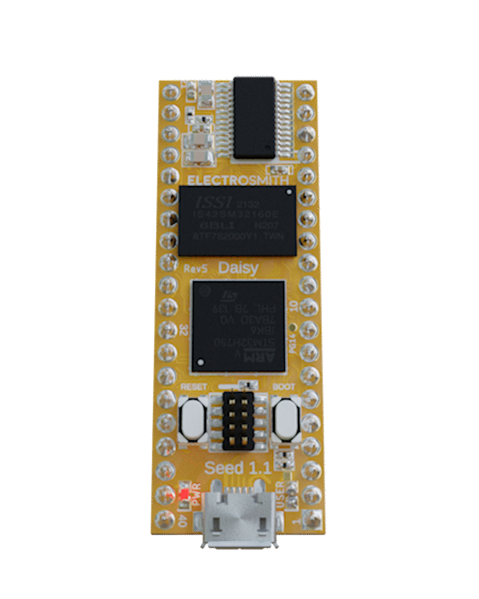](https://docs.daisy.audio/hardware/Seed/#pinout) | 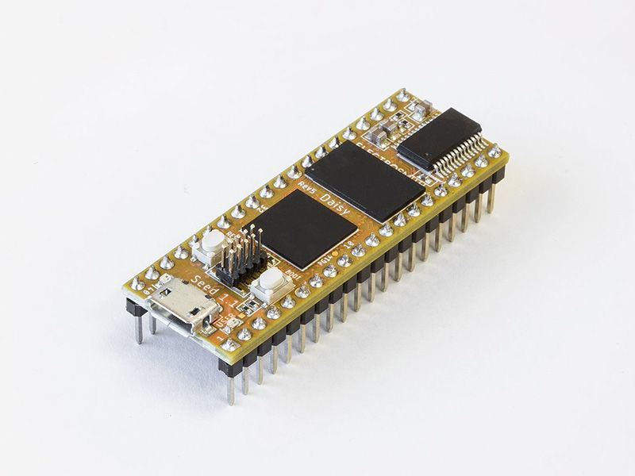 |
|--|--|

[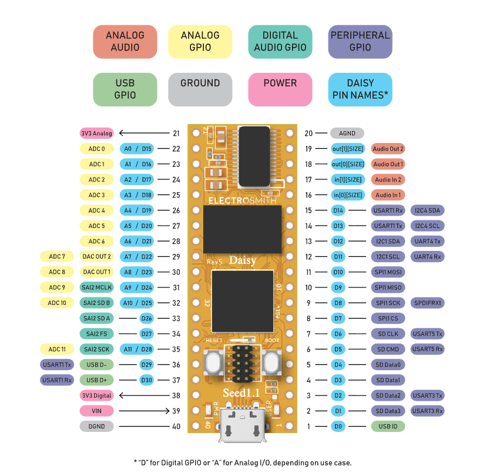](https://docs.daisy.audio/hardware/Seed/#pinout)

The **Daisy Seed** is a small development board, similar to an Arduino or Teensy, but with an integrated stereo audio IO interface. It is suitable for developing DIY projects on breadboard type environments, but scalable to professional hardware PCB products (and now widely used in synths and guitar pedals).

- Powered by an ARM Cortex-M7 microcontroller running at 480 MHz for real-time audio processing
- Audio Quality: Supports high-resolution stereo audio (up to 96kHz/24-bit or 192kHz/32-bit depending on the specific module/seed version)
- Many GPIO pins that can be configured for analog or digital input or output, making it easy to connect things like buttons, switches, knobs, LEDs, control voltages and other circuits 
- Some pins that can be configured for specific protocols and purposes, such as MIDI, I2C, SDCARD, etc. 

Collections of example projects:
- Profiled: https://daisy.audio/blogs/seeds-n-circuits
- Community: https://community.daisy.audio/c/projects-and-examples/
- Join the Discord to view more in the Show-and-Tell section: https://discord.com/invite/ByHBnMtQTR
- Examples in Github: https://github.com/electro-smith/DaisyExamples

Specific products & projects using Daisy:
- Standalone Devices
  - Chompi Sampler https://www.chompiclub.com/
  - Pocket Audio HiChord https://hichord.shop/
  - Vongon Replay https://www.vongon.com/pages/replay
  - Enjoy Electronics Godfather https://www.enjoy-lab.com/godfather
  - Xtrike: https://www.indiegogo.com/en/projects/xaudiosystems/xtrike-impact-driven-wavetable-synthesizer
  - Recovery Effects Seven Sisters https://recoveryeffects.com/products/seven-sisters-percussion-synthesizer
  - SynthUX Touch, Audrey and Spotykach https://www.synthux.academy/
  - YMNK POly Analog https://www.ymnkmusic.com/project/13
  - ginTronic TransparentSea https://gintronic.io
- Eurorack modular
  - Venus Instruments Veno Echo & Veno Orbit https://www.venusinstrumentsaudio.com/
  - Modbap Modular Per4mer & Osiris (**written with Oopsy**) https://www.modbap.com/
  - Fancyyyyy K-Accumulator (**with Oopsy**) https://www.fancysynthesis.net) 
  - Hermetic Alchemy Lab https://hermeticmodular.com/
  - OXI Instruments Coral https://oxiinstruments.com/oxi-coral
  - Entropic Loop Grackle https://entropicloop.com/shop/p/grackle
  - Ampersand Wear & Tear https://ampersandampersand.co/products/wear-and-tear
  - Olivia Arts Time Machine https://oamodular.org/products/time-machine
  - Infrasonic Warp Core https://infrasonicaudio.com/products/warp-core
  - Isobar Industries Serratus https://isobar.studio/serratus
  - System Lizard Iguanamente https://www.systemlizard.com
  - Blukač Instruments Endless Processor https://www.blukac.com/endless-processor.html
  - Noise Engineering Legio and Alia platforms https://noiseengineering.us/
  - QuBit Data Bender, Surface, Aurora, Mojave, Nautilus, Bloom v2 https://www.qubitelectronix.com/
  - Electrosmith Patch.Init https://daisy.audio/products/patch-init
- Guitar pedals
  - Pure Magnetik LAPS https://puremagnetik.com/products/laps-multitrack-collage-machine
  - GuitarML SoundSketch, Funbox and Seed https://guitarml.com/pedals.html
  - TONE3000 Neural Amp Models on the Daisy Seed https://www.tone3000.com/blog/running-nam-on-embedded-hardware
  - Cleveland Audio Hothouse https://community.daisy.audio/t/hothouse-dsp-pedal-kit/5631 & https://github.com/clevelandmusicco/HothouseExamples
  - PedalPCB Terrarium https://www.pedalpcb.com/product/pcb351/ 
  - Keith Shepherd collection here https://github.com/bkshepherd/DaisySeedProjects
  - NYU Pedal projects (**using Oopsy**) https://idmnyu.github.io/IDMPEDALS/
  - Sam Knight's Pedal Tutorial https://github.com/skngh/How-to-Make-a-Guitar-Pedal and https://www.youtube.com/watch?v=QKbvmnLBfEQ&list=PLXj_YR5uUMrulxui4f4sE3yInUK220c-X
  - Atlas Reverb/Delay https://www.reddit.com/r/diypedals/comments/17p2hj0/atlas_reverb_and_delay_pedal_using_daisy_seed/
  - Dub Siren Pedal (**with Oopsy**) https://www.youtube.com/watch?v=qOSyVUJKIQw&feature=youtu.be
  - Euclidean Tremelo (**with Oopsy**) https://www.youtube.com/watch?v=Tfp7akjn5n0
  - Snowstorm (**with Oopsy**) https://www.youtube.com/watch?v=kS47zSkWa5c

> We have several Daisy Seed boards to use in this class, along with breadboards and many different sensors and other components we can use, including LEDs, knobs, switches, buttons, LED buttons, mono and stereo jacks, light sensors, piezos, touch sensors, muxes, various ICs such as opamps, counters, shift registers etc.

Daisy can be programmed in C++, Max/MSP (Gen~), Pure Data, or Arduino. We'll mostly focus on Max (or C++) in the class. But first, to program a Daisy Seed, we need to install a few things (the "toolchain"). 

# Installing the libdaisy Toolchain

Before we can flash code to the Daisy, there's a lot of software dependencies we need to install for the required toolchain.  We only need to set up this toolchain once, but it requires quite a few steps and careful attention along the way! 

Let's start at the [Getting Started](https://docs.daisy.audio/tutorials/cpp-dev-env/) page of the Daisy docs. The libDaisy toolchain includes several other tools:

- `Git` for obtaining the source code
- `Make` for Makefile-based compilation of library and examples
- `ARM Toolchain` used to cross compile for the Daisy processor
- `dfu-util` for flashing programs from the command line
- *(Windows only)* `Zadig` to reset the USB driver

For working with Max/MSP, we'll also need:

- Max: https://cycling74.com/downloads
- Oopsy: https://docs.daisy.audio/tutorials/oopsy-dev-env/

Before following the tutorial to install these, you will need to have some pre-requisites installed. 

## Mac

You have two options.  

1. Do you have [Homebrew](https://brew.sh/) installed? 
   - Type `brew -v` into a terminal.  If it replies with a version number, you can install the toolchain with this command: 
   - `brew install make armmbed/formulae/arm-none-eabi-gcc dfu-util`

2. If not, you can do it via the **Apple Developer Tools**. Xcode is Apple's developer envionment.  It is a huge project and download, but we don't need the whole thing for our purposes; we just need the more minimal "developer tools". 
   - Do you have Xcode developer tools installed? 
     - Run `xcode-select -p` in a terminal. If it replies with a file path on your system, you have it installed. 
     - If not, install it with `xcode-select --install`. This could take some time. 
   - Next follow the instructions of **Install the Toolchain** at https://docs.daisy.audio/tutorials/toolchain-mac/

## Windows

First, check whether you already have `git` installed! Open a Command Prompt or Powershell, and type `git --version` -- if it replies with a message starting with `git version` then you already have git. If not, you need to install `git`, by running the downloadable isntaller from https://git-scm.com/install/windows

> What is `git`? Git is a free, open-source distributed version control system designed to track changes in source code and files over time. It is probably the most common way for software developers to distribute code projects today. A project is held in a 'git repository', possibly with different versions in 'branches', which are updated through 'commits'. How it works is beyond the scope for this class, but we will need `git` in order to install the Daisy toolchain. 

Next follow the instructions of **Install the Toolchain** at https://docs.daisy.audio/tutorials/toolchain-windows/

> You **do not need to install Python!**

However, it is likely that you will need to use Zadig to reset USB drivers for flashing to the Daisy. See the instructions at https://docs.daisy.audio/tutorials/zadig/

## Installing Oopsy for Max

Once you have [Max](https://cycling74.com/downloads) installed, you need to add the Oopsy package.  **Oopsy** is a way to turn Max's `gen~` patches into Daisy firmware, and flash the firmware onto the Daisy directly.  

To get the Oopsy package, either use the download link or `git clone` it as described at https://docs.daisy.audio/tutorials/oopsy-dev-env/#getting-oopsy

- If you downloaded a zip file, you should unzip the zip file to get an Oopsy folder.  
- If you get it by `git clone https://github.com/electro-smith/oopsy.git`, make sure you also then `cd oopsy` and `./install.sh` to build it. 

Now for Max to be able to see Oopsy, we need to install this folder as a "package" for Max, by moving `oopsy` folder into Max's Packages folder.  
- On Windows that means moving it into `C:\Users\YourUserName\Documents\Max 9\Packages`.  
- On Mac, move it to your user `Documents/Max 9/Packages`.

Now you can restart Max, and verify that `oopsy` is installed:
- Make a new patcher with Cmd-N or File -> New patcher
- Create an oopsy object by pressing 'n' and typing `oopsy.pod`. You should get something that looks like this:

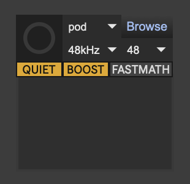

If not, try restarting Max. If that doesn't work, retrace the installation steps. 

## How does Oopsy work?

The main idea is that you have a Max patch that contains both an `oopsy` object and a `gen~` object.  Every time you save the patch, or click the button in the `oopsy` object, it does the following:

- It finds the `gen~` object, and makes it export its code as C++
- It then reads that C++ code and analyzes it, to find out what inputs and outputs it has.  This includes: 
  - audio inputs (`in` objects) 
  - audio outputs (`out` objects)
  - control inputs (`param` objects with specific names)
  - control outputs (`history` objects with specific names that end with `_out`)
- It imports a target definition file, in JSON format, which specifies how the Seed is configured, including how GPIO pins are configured (for knobs, switches, LEDs, etc.), and what names to identify these with
- It then generates C++ code that maps the patcher's audio C++ code and IO to the JSON configuration
- It compiles this C++ code using a Makefile and the ARM gcc compiler to produce a binary firmware `.bin` file
- It then attempts to flash this `.bin` to the Daisy over USB, using `dfu-util`, reporting any errors back to Max. 

That's a lot of work that you don't have to think about most of the time!  

Most of the time, your job is to 
- **Target definition**: efine the hardware JSON according to what you physically have connected to the Daisy on the circuit
- **Audio design**: define the gen~ patcher for your audio algorithms

## Flashing from Oopsy

Let's make a minimal example:

- Save your patcher somewhere on your disk.  That folder will be your project working folder. 
- Make sure your patcher has a single `gen~` object in it. To create one, type 'n' and type `gen~`.  Oopsy will now use that gen~ object to compile and flash to the Daisy. 
- Make sure your patcher has a single `oopsy` object in it. To create one, type 'n' and type `oopsy.pod`. 
- Pick your target JSON.  You can just select "pod" from the drop down menu in the `oopsy` object if you haven't defined a JSON yet.  If you have defined a JSON, click the `browse` button to find it, or send a `target mydef.json` message to oopsy (assuming you have a `mydef.json` file in the same folder as the patcher). 
- Connect up your computer to the Daisy with a USB cable.  *(note, not all USB cables work -- some cables are only "charging" cables, not data cables)*
- On the Daisy, push the buttons to put it into bootloader mode as follows:
  - Press and hold the Boot button
  - Press and hold the Reset button
  - Let go of the Reset button
  - Let go of the Boot button

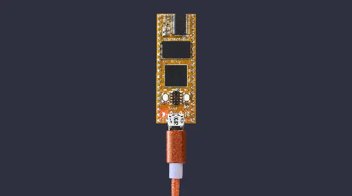

- Switch out of edit mode (Ctrl-E) and push the button on the Oopsy object, and it will try to flash.  It can take a few seconds. 
  - If it worked, one LED on the Daisy will be solid on, and the other LED will blink once per second (it may be a very short blink though!)
    - **That blink is indicating the CPU usage** -- the blink on time is very short because our gen~ patch is very simple!  A more complex gen~ patch would have a blink with a longer on-time. 
  - If it says "DFU error" or "No DFU capable device available", there are a few possible reasons:
    - The USB cable is not connected, or is not a data-capable cable
    - **Windows only** you may need to use Zadig to set up your USB driver, see https://docs.daisy.audio/troubleshooting/#oopsy
    - Perhaps libdaisy is not fully installed & built. Try again with the QUIET button on the Oopsy object switched to VERBOSE.  If there's an error in the Max window like "oopsy-verbose: "stderr . . . . . cannot find -ldaisy"", see the instructions at https://docs.daisy.audio/troubleshooting/#oopsy to build libdaisy. 

## Daisy on a Breadboard

If we want to hear the audio output and start manipulating the algorithm, we'll want to start connecting components to it (such as stereo headphone sockets).  The best place to start is with a prototyping breadboard. Here is how a broadboard is internally connected:

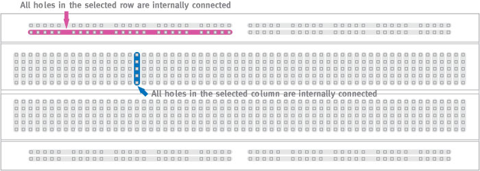

### Placing the Daisy

We'll first place a Daisy onto a breadbard. **Do this very carefully -- we really don't want to bend any of the pins!**  First, line up the Daisy over the pin holes.  Typically we'll want the Daisy's USB socket at the edge of the breadboard, and the Daisy's centre aligned to the track that runs through the middle of the breadbard. Typically this means you'll have 2 or 3 pins free at either side of the Daisy (see photo below). Then very evenly push on all four corners at the same time, gently first and then more firmly as you find the point where it starts to go in. (*If you don't feel confident, ask me.*)

> (If you ever have to remove it, the best way is to slide a cable or string through the channel underneath the daisy, then pull slowly on both ends of the cable/string to start lifting the chip out of the breadboard.  The key is to lift it evenly at all sides, so that no pins get bent!)

### Identifying pins

Depending on what inputs and outputs you want to use, and how they are configured in your target JSON file, you'll need to wire up different pins to different components on the breadboard.  

To know which pins correspond to what purposes, see the [pinout diagram](https://docs.daisy.audio/hardware/Seed/#pinout) at the top of this page or on the https://docs.daisy.audio/hardware/Seed/ page. 

For a more detailed view of the pins, see the [Datasheet](https://daisy.nyc3.cdn.digitaloceanspaces.com/products/seed/Daisy_Seed_datasheet.pdf)

### Wiring up Ground

Ground is also known as the zero volt (0V) reference. The Daisy has two ground ports at pins 20 ("analog ground") and 40 ("digital ground") on the board.  You'll nearly always want to connect these together with your board's ground. 

If you put the USB port to your left, this is the top-left and bottom-right pins. Connect both of these to the blue ground rails on the breadboard. (*I recommend using blue jumper cables consistently to represent ground.*)  It's easier to wire these to the nearest rail, and then at the other end of the breadboard, put another jumper cable between the two rails to connect them together. 

### Wiring up audio output  

The pinout identifies pins 18 & 19 as the two audio output channels.  If you have the USB port to the left, then these are the two pins at the bottom right just before the analog ground pin. 

| mono | stereo |
|--|--|
| A **mono** audio jack needs both the signal and the ground wired up.  The signal goes to the *tip* and the ground goes to the *shield/sleeve*. | A **stereo** audio jack needs two signals plus ground wired up.  One signal channel goes to *tip*, another goes to *ring*, and ground goes to *shield/sleeve*. |
| 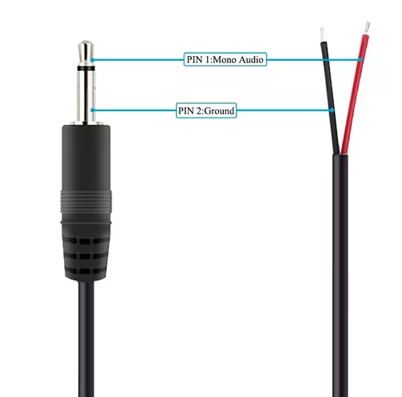 | 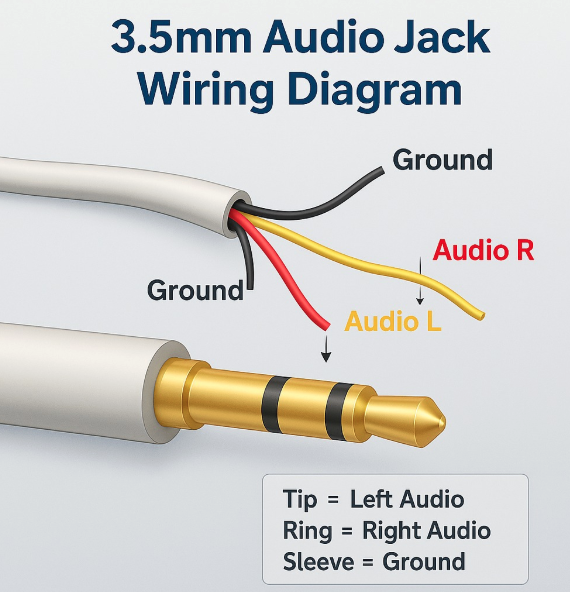 |
| 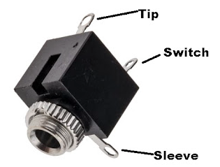 | 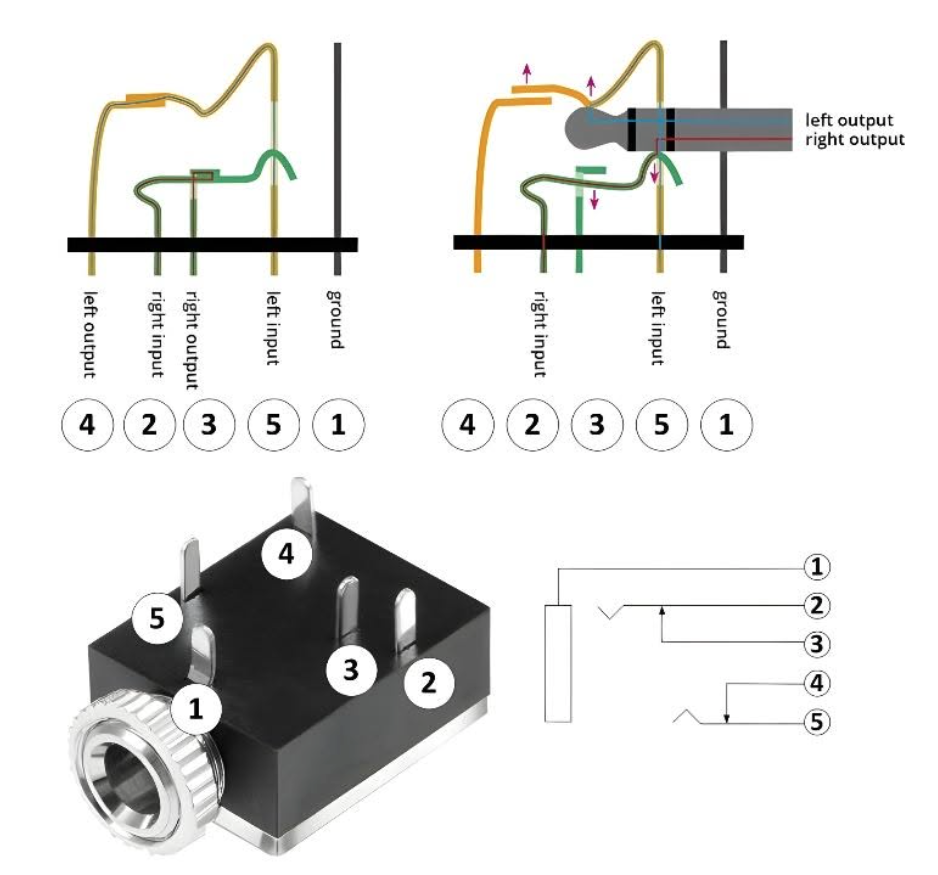 |

> Notice that the sockets also have *switch* pins.  This is how you would send a signal if you wanted a "default" or "normal" signal when nothing is plugged in. In modular synths these default signals are called "normalled" connections. 

### Example from Week 2

Wiring:

|  |  |
|--|--|
| 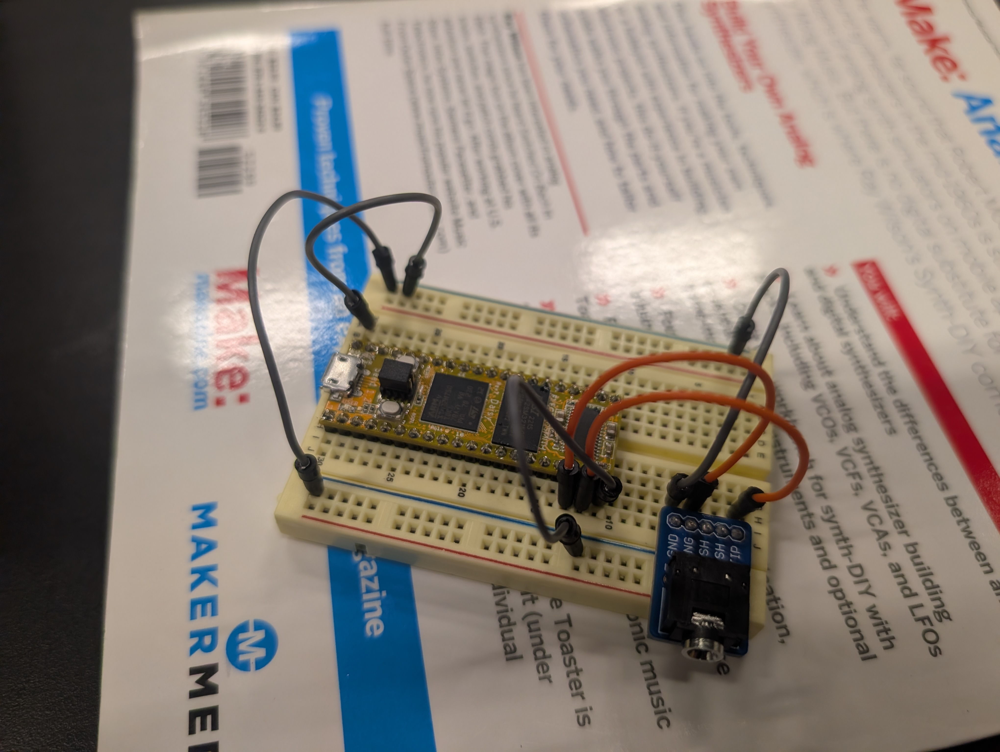 |  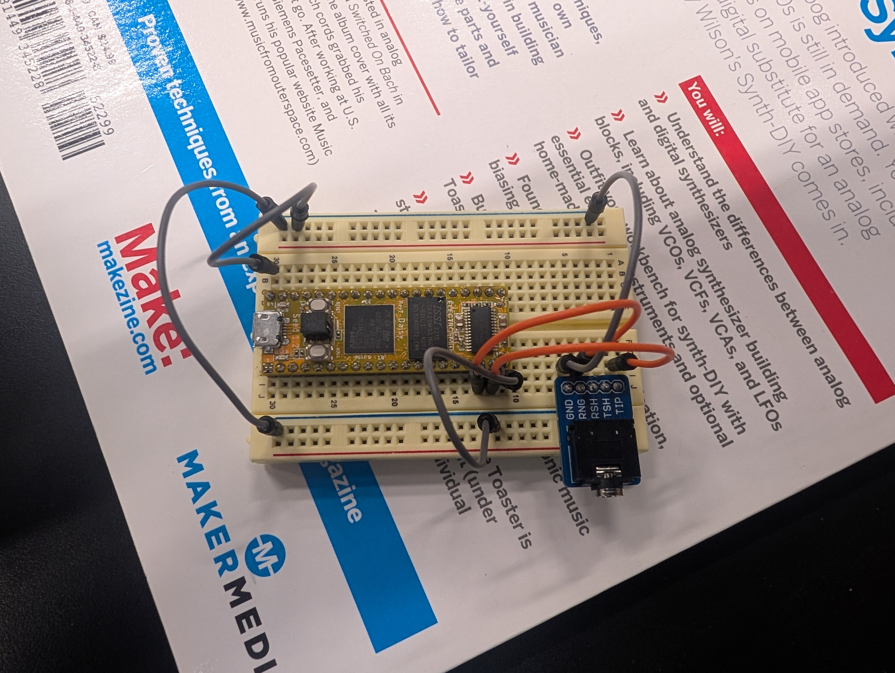 |

- Insert Daisy to breadboard
- Insert Stereo Socket to breadboard
- Connect both ground rails on the breadboard
- Daisy AGND (pin 20) to nearest ground rail
- Daisy DGND (pin 40) to nearest ground rail
- Audio Socket GND to nearest ground rail
- Daisy Audio 1 (pin 18) to Audio Socket Tip
- Daisy Audio 2 (pin 19) to Audio Socket Rng (Ring)
- Connect USB to Daisy and computer for power

| Max patch: | gen~ patch: |
|--|--|
| 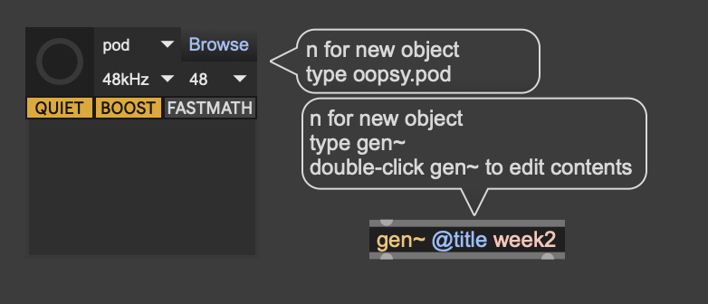 |  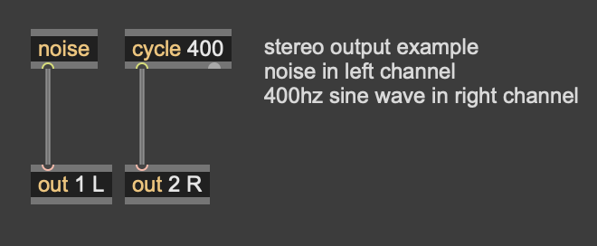 |

Here's the example Max patch:

<pre><code>
----------begin_max5_patcher----------
895.3oc6XkrjZCCD8NeEp7YFJKuAjS4CHmx0Ppo7RCnYLRtjjYYlh7sGIYfY
RPxfwIjplJ9BK8SRV868Za0uN.ot7xXaAg2mPey7S80qm91Q.pv+5eZBrJca
dYpPOXub1pU.U5M7bXRXqTCghly3HJrAwxdBxkynxcU.ZAP+wLZAqNqDdHuj
j+r4uPRFBJHRTNiJUyrv1TWRnPNqlpm+PKwq3fPM1TIgQe78firANUlujPW7
HWcyoSHn.b7H+gHr5iP8UbR3D+njfD0+MMPGJIYjO56Vlrr5L09QPJ.0LE3D
fJH1RPZ8JBsDjBGwIE5DpJM9.1y9vY0xCi2+Whu+zu1OrWDthGUqusUecJml
tRu071..7bPahBCU+YIQc2h13BrElINzvLSBOmY7mnCED3fYZxLZomYl7DjE
zzRugm9l0Qc8LRxEYj.WaQfaMua.LmTBqAtPojseKXPkVU8FH6yzAl7Ildwl
NrELDpACtELbXM4vpE2BrTth+jJxqlazEaSh7ZakYE.mVSzKtUT6cr8MpSs3
STklaVoBQ0HkFywp4cRPoTM3FYyTiuFazWJgkcUjiJm+9kaFnUi1MVo0oISH
ANvPJEXUsDAaSWUUBynTFQ.HBEUByU0YWlRoP4LZju+xWPBU0Rzlz0F.bxhk
mPbMq7EJLeENb73HMCLYrgUvleDM1MazE2ZGcuco95YJUmQ2O7tJabVu1opI
eWtpnrRM3caDnO9MBLdZa0juXMZc0YuNy79ch4wcl4C9nx7psHJ.80dw63jf
iV1NP72twM9+F2Sunstt9sQdQSeyyFNted1+x90vNS33Ox9UL5K8gxOZWiuS
10n6mc0ZDWuSm9EW506zYRv5Y45HdAqlmevwb3oPnqK2W.BIgZNZ6aCOtY32
cgdO20g8aWG0ucscAxf1w8G6fz2dmSXrJwtQUrhK0Zjfq5L03olCNOd74GoN
1+3CDZoYG8tWFw+q5kQ1wSeaqaFDXi9LtYjRhbmi8.a9bAzjEMYJeGIpRV9y
PQAOcgHmyJKs+POOSWvjK4r5EKc.AnopT9xVmlFLqaESycjf7B3.P1B8owcE
jwKLMsv+pTXIG6VSPf531giisq1BM4PbvDGYwT9BQi4Wq8uo10brAUMVHkVP
cy50p3L71EmCd2Cbb0gFacjwVGXbzwkKzgky6nxAGikNlncLC1+S0yQWjB
-----------end_max5_patcher-----------
</code></pre>

If you want to add an audio input, use pins 16 & 17 on the Daisy to connect to another stereo socket (or pair of mono sockets), being sure to also connect the socket sleeve pins to ground.  In `gen~`, these audio inputs are available as the `in 1 ` and `in 2` operators. 

## Adding more components

To add more components, we'll need to start using GPIO pins, define a custom JSON, and usually we will also need the 3.3v (3v3) power rail hooked up.

### Connecting the 3v3 rail

Many components, such as knobs, need a positive reference voltage in addition to ground. 

Typically we will use the analog 3V3 (3.3 volts) pin for this reference voltage -- that is on pin 21, at the top right of the Daisy if you have the USB socket at the left.  In this case, we can simply connect "pin 21 3v3 Analog" to our red positive rail on the breadboard.  *I recommend using red jumper wires for this.*  It makes sense to use 3v3 as our reference, because these analog GPIO pins can only detect values between 0v and 3v3. 

### Adding a knob

A knob, or properly speaking, a **potentiometer** (or "pot"), is a component with variable resistance.  Typically pots have three pins: the left and right pins hold the two reference voltages, and the middle pin (the "wiper") produces a voltage between these according to the position of the knob. 

Place the pot on the breadboard to the right of the Daisy, so that each of the 3 pins has a unique 5-socket vertical track.  

We can use our ground rail as one refernence voltage.  Connect a jumper from the the left pin's column to the nearest ground rail. 

Once we have a 3v3 rail set up, connect the pot right pin's column to this rail (again with a red jumper wire). 

Typically we will use the analog 3V3 (3.3 volts) pin for the other reference voltage -- that is on pin 21, at the top right of the Daisy if you have the USB socket at the left.  In this case, we can simply connect "pin 21 3v3 Analog" to our red positive rail on the breadboard.  *I recommend using red jumper wires for this.*  It makes sense to use 3v3 as our reference, because these analog pins can only detect values between 0v and 3v3. 

Once we have 3V3 rail set up, connect the pot right pin's column to this rail (again with a red jumper wire). 

Now the middle "wiper" pin of the pot needs to connect to one of the Analog-capable GPIO inputs on the Daisy.  Again look at the pinout: these pins are prefixed with "A", such as "A0", "A1", etc. We'll need to pick one of these and wire it up to the wiper (using some jumper color that isn't red or blue). Also write down what the GPIO pin number was -- not the number of the board, not the "A" number, but the "D" number -- because we'll need that to configure our JSON file. E.g. if you used pin 27 on the board, which is marked "A5/D20" on the pinout, then the GPIO number we need is 20 (not 5 or 27)!  *Confusing, I know.*

Here's an example of a breadboard with a Daisy wired up with a knob on GPIO pin 20 (board pin 27) and a mono audio socket for the left channel:

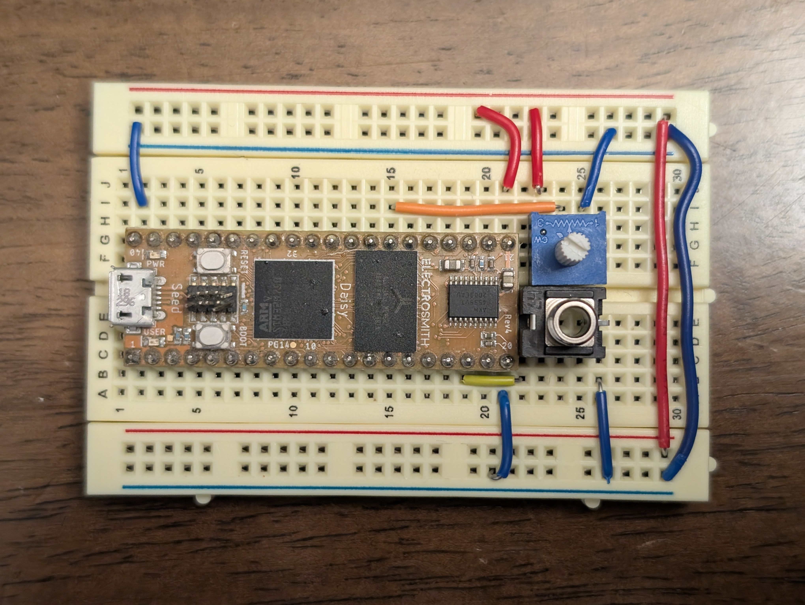

### Define the JSON

If we are doing any kind of GPIO connection, we'll need to define a custom JSON file to let Oopsy know what inputs & outputs we have and how to generate the code for them. 

Every time we connect up a component to one of Daisy's GPIO pins, we need to modify our target JSON so that it knows what it is. 

So far we hooked up a potentiometer to GPIO pin 20, so we can define our JSON file as follows -- create this file and save it as `mydef.json` in the same folder as your Max patch. 

```
{
	"som": "seed",
	"components": {
		"knob1": {
			"component": "AnalogControl",
			"pin": 20
		}
	}
}
```

Every component has 
- a unique name, which we will use in the gen~ patcher. Here it is `knob1`
- a specific component type. Here we used `AnalogControl` because it is continuous input between 0v and 3v3. 
- a pin (or in some cases, multiple pins) that it is connected to on the Daisy
- (other possible options for how the component behaves)

To tell Oopsy to use this JSON, send the message `target mydef.json` to the `oopsy` object in your patcher so that Oopsy knows to use it. (I recommend connecting a `loadbang` to this message so that it does it every time you open the patch).

Now you can use a `param knob1 @min 0 @max 1` in your patcher to control your audio processing. Example gen~ patch:

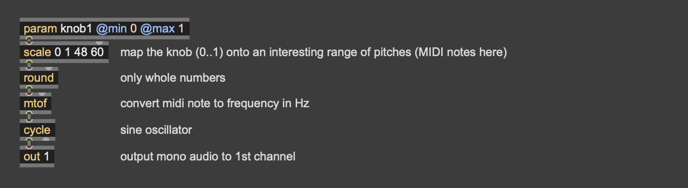

**Button**: 

- For a 2-leg button: connect one leg to any digital pin (any pin with a "D" name). Connect the other leg of the button to a ground rail. If a switch has 3 pins, just use the middle pin and one of the end pins. 
- In the JSON, use `Switch` as the component type and give it a name like `button1`. 
- In gen~ you can use `param button1 @min 0 @max 1` to access the button value. (You can also use different min & max values as desired!)

**LED**: 

- LEDs have polarity -- it matters which way you plug them in.  The longer leg of the LED is the anode (positive), which should connect to a digital pin on the Daisy. The shorter leg of the LED is the cathode (negative), which should connect to a ground rail. **However, you should always connect one or the other pins of the LED to ground in series with a resistor**, to prevent current overflow burning out the LED. So for example, connect Daisy digital pin -> resistor -> LED -> Ground. Something between 100-1k ohms is typically fine for the resistor. 
- In the JSON, use the `Led` as the component type, and pick a useful name like `led1`. 
- In the gen~ patch, use a `history led1_out` (i.e.,`<componentname>_out`). Set the LED on or off by sending 0 or 1 to this `history` object. 

There are lots of other possible components we can use, but this covers the basics. 

### A simple example with mono push-button oscillator

Here's an example wiring diagram for a simple oscillator with button, knob, and audio output:

| circuit schematic | breadboard layout |
|---|---|
| 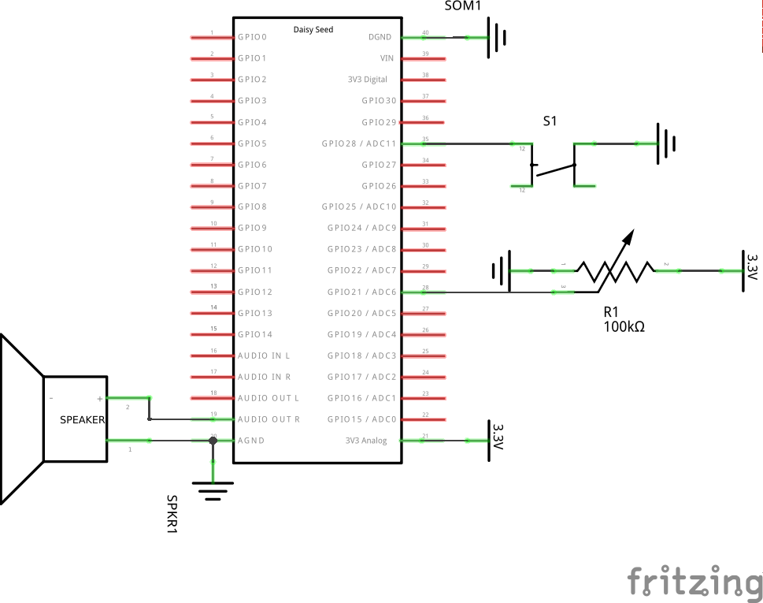 | 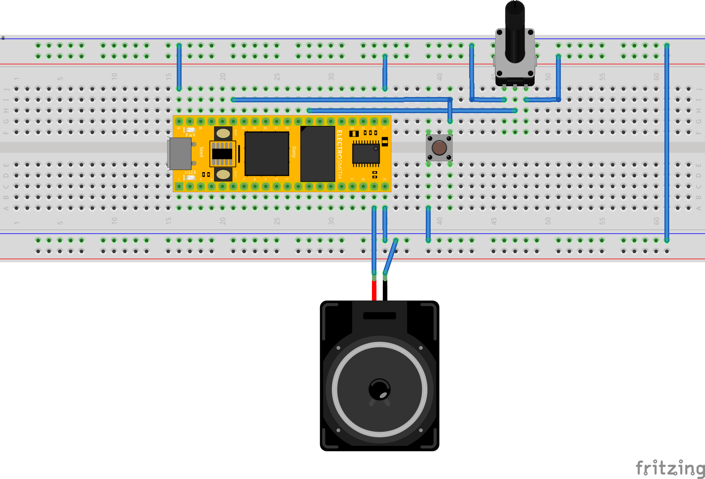 | 

Custom JSON target file:

```
{
	"name": "mydef",
	"som": "seed",
	"defines": {},
	"components": {
		"knob1": {
			"component": "AnalogControl",
			"pin": 21
		},
		"button1": {
			"component": "Switch",
			"pin": 28
		}
	}
}
```

Save this as `mydef.json` in the folder, and send the message `target mydef.json` to the `oopsy` object in your patcher so that Oopsy knows to use it. (I recommend connecting a `loadbang` to this message so that it does it every time you open the patch).

Now you can use a `param button @min 0 @max 1` and a `param knob1 @min 0 @max 1` in your patcher to control your audio processing.  Example gen~ patch:

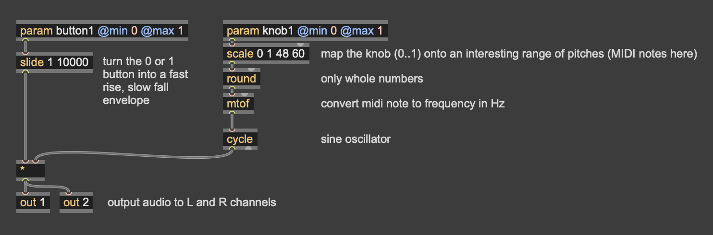

---

## `oopsy` object options & messages

- `bang`: tells Oopsy to compile the patch and try to flash it to a USB-connected Daisy. 
- `target <jsonfile>`: where `jsonfile` is the path to a JSON file on disk.  Tells Oopsy what JSON target definition to use.  We have to make a JSON to configure all GPIO pin connections for our circuit.
- `blocksize <N>` where `N` can be 48, 32, 16, 8, 4, 2 or 1. How many audio samples pass in each block of processing between processing GPIO data. Making this lower will make inputs and outputs more responsive, but will also increase the CPU load.  I suggest starting with 16 or 8, and increase only if you have to.
- `samplerate 96khz`, `samplerate 48khz`, `samplerate 32khz`: choose what sample rate to use. 48khz is normal, the same as DVD audio. 96khz may be desirable to help reduce aliasing artefacts with nonlinear audio algorithms, but CPU load will double.  32khz may have audibly lower quality, but will reduce CPU load.

> I recommend using a `loadbang` object to send your preferred settings to `oopsy` when the patcher loads -- especially if you use a custom JSON target file. 

Other options: 
- `boost 0` or `boost 1`: Enabling boost will run the CPU at a higher clock speed, increasing performance (and energy use).  I recommend enabling this unless you expect to use battery power. 
- `fastmath 0` or `fastmath 1`.  Enabling this will reduce accuracy of many mathematical operations (power, trigonometry, etc.) to save CPU cost. This may reduce audio quality, so I do not recommend it unless absolutely necessary. 

## List of possible components

Basic components:

| Component | Values	| Pins 	| Options	| 
|---		|---		|---	|---		|
| Switch 	| `name` (0/1), `name_press` (0/1), `name>_seconds` (float) | 1 | type=**momentary**/toggle, polarity=normal/**inverted**, **pullup**/pulldown/nopull |
| Switch3 (3 position switch) 	| `name` (0/1/2) | 2 | |
| GateIn	| `name` (0/1), `name_trig` (0/1) | 1 | invert=true/false |
| Encoder 	| `name` (-1/0/1), `name_press` (0/1), `name_rise` (0/1), `name_fall` (0/1), `name_seconds` (float) | 3 | |
| AnalogControl | `name` (0..1) | 1 | invert=true/**false**, flip=true/**false** |
| GateOut 	| `name_out` (0/1) | 1 | pullup/pulldown/**nopull** |
| Led 		| `name_out` (float) | 1 | invert=**true**/false |
| RgbLed 	| `name_red_out`, `name_green_out`, `name_blue_out`, `name_white_out` (all float 0..1) or `name_out` (-1..1) | 3 | invert=**true**/false |
| CVOuts	| `name1_out`, `name2_out` (0..1) | hardware 29 & 30 | 8bit/**12bit**, **polling**/DMA |

For a more items see https://raw.githubusercontent.com/electro-smith/oopsy/refs/heads/dev/source/component_defs.json -- there are examples there for 
- CD4021 button/switch multiplexor (8 buttons from 3 pins)
- CD4051 analog multiplexor (8 knobs from 4 pins)
- PCA9685 LED controller with mono or RGB Leds
- PCA9685 motor controller for stepper motors/DC motors
- NeoTrellis light/button array
- MPR121 capacitative touch sensor
- Hall effect sensor
- APDS9960 proximity, light, RTBG and gesture sensor
- BME280/BMP390/DPS310 temperature/humidity/pressure/altitude sensor
- VL53L1X/VL53L0X time-of-flight distance sensor
- TLV493D 3-axis magnetometer
- BNO055/ICM-20948 9-DoF orientation accelerometer/gyro/magnetometer

... And other things not listed can still be defined & created in C++. 